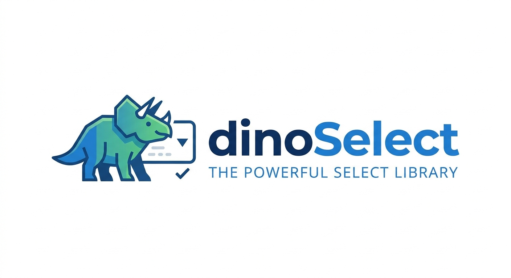

  

# DinoSelect

Selector moderno, liviano y sin dependencias. Alternativa a Select2 con búsqueda por fragmentos y soporte server-side.

## Instalación

``

## Uso Básico

`<select id="mi-select">
    <option value="1">Manzana</option>
    <option value="2">Pera</option>
    <option value="3">Plátano</option>
</select>

`

## Opciones

- **placeholder**: Texto del placeholder (default: 'Selecciona una opción...')
- **noResultsText**: Mensaje sin resultados (default: 'No se encontraron resultados')
- **loadingText**: Mensaje de carga (default: 'Cargando...')
- **allowClear**: Muestra botón para limpiar (default: false)
- **searchable**: Habilita búsqueda (default: true)
- **minCharsForSearch**: Mínimo de caracteres para buscar (default: 1)
- **debounceTime**: Tiempo de espera antes de buscar en ms (default: 300)
- **serverSide**: Habilita modo servidor (default: false)
- **endpoint**: URL del API (default: null)
- **perPage**: Items por página (default: 20)
- **customTemplate**: Template personalizado (default: null)

## Modo Servidor

`new DinoSelect('#usuarios', {
    serverSide: true,
    endpoint: '/api/usuarios',
    perPage: 20,
    minCharsForSearch: 2
});`

### API Esperada

`{
    "items": [
        { "id": 1, "text": "Juan Pérez" },
        { "id": 2, "text": "María García" }
    ],
    "totalPages": 10,
    "totalItems": 200
}`

### Parámetros que envía

- page: Página actual
- per_page: Items por página
- search: Término de búsqueda

## Templates Personalizados

`new DinoSelect('#select', {
    customTemplate: (item) => \`
        

            <strong>${item.text}</strong>
            ID: ${item.id}
        

    \`
});`

## Métodos Públicos

`const select = new DinoSelect('#mi-select');

select.getValue()   // Obtener valor seleccionado
select.setValue('2')  // Establecer valor programáticamente
select.reload()    // Recargar opciones
select.destroy()   // Destruir instancia`

## Eventos

`document.getElementById('mi-select').addEventListener('change', (e) => {
    console.log('Valor:', e.target.value);
});`

## Navegación por Teclado

- ⬇️ Flecha abajo: Siguiente opción
- ⬆️ Flecha arriba: Opción anterior
- ⏎ Enter: Seleccionar
- ⎋ Esc: Cerrar dropdown

## Estilos CSS

**Clases principales:**
- `.dinoselect-wrapper`: Contenedor principal
- `.dinoselect-input`: Campo de entrada
- `.dinoselect-dropdown`: Dropdown de opciones
- `.dinoselect-option`: Cada opción
- `.dinoselect-highlight`: Texto resaltado en búsqueda

**Ejemplo de personalización:**

`.dinoselect-input {
    border: 2px solid #007bff;
    border-radius: 8px;
}

.dinoselect-option:hover {
    background: #f0f0f0;
}

.dinoselect-highlight {
    background-color: #ffeb3b;
    font-weight: bold;
}`

## Ejemplos

**Select sin búsqueda:**
`new DinoSelect('#select', {
    searchable: false
});`

**Búsqueda desde 3 caracteres:**
`new DinoSelect('#select', {
    minCharsForSearch: 3,
    debounceTime: 500
});`

## Compatibilidad

Chrome, Firefox, Safari, Edge (últimas 2 versiones)

## Licencia

MIT